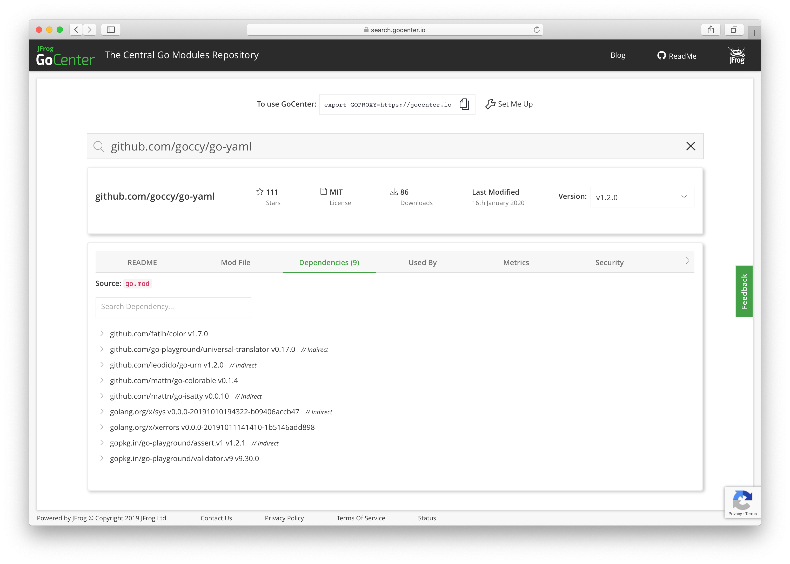
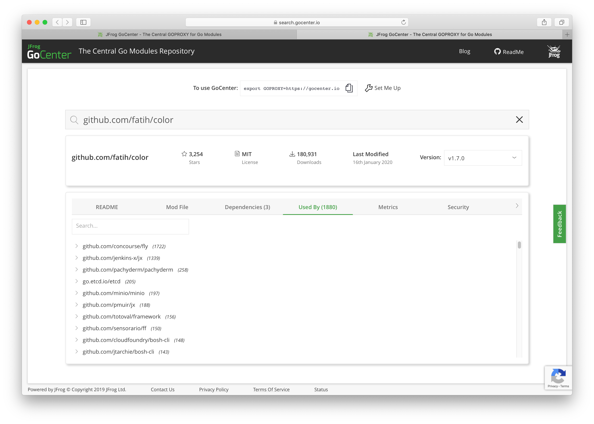

# Solution

Create a new directory and navigate to it in the console. Initialize Go Modules.

```bash
$ mkdir code
$ cd code
$ go mod init github.com/bmuschko/proxy
go: creating new go.mod: module github.com/bmuschko/proxy
```

Search for the dependency on GoCenter.



Pick one of its transitive dependencies and open it. You will find that some of the dependencies have many "Used By" occurrances.



Set the proxy environment variable to GoCenter. Verify its value.

```bash
$ go env -w GOPRIVATE=https://gocenter.io
$ go env
...
GOPROXY="https://gocenter.io"
...
```

Add the latest version of the dependency `github.com/goccy/go-yaml`. The dependencies are now resolved through the proxy.

``` bash
$ go get github.com/goccy/go-yaml
go: finding github.com/goccy/go-yaml v1.2.0
go: downloading github.com/goccy/go-yaml v1.2.0
go: extracting github.com/goccy/go-yaml v1.2.0
go: downloading github.com/fatih/color v1.7.0
go: downloading golang.org/x/xerrors v0.0.0-20191011141410-1b5146add898
go: extracting github.com/fatih/color v1.7.0
go: downloading github.com/mattn/go-colorable v0.1.4
go: downloading github.com/mattn/go-isatty v0.0.10
go: extracting golang.org/x/xerrors v0.0.0-20191011141410-1b5146add898
go: extracting github.com/mattn/go-isatty v0.0.10
go: downloading golang.org/x/sys v0.0.0-20191010194322-b09406accb47
go: extracting github.com/mattn/go-colorable v0.1.4
go: extracting golang.org/x/sys v0.0.0-20191010194322-b09406accb47
go: finding golang.org/x/xerrors v0.0.0-20191011141410-1b5146add898
go: finding github.com/fatih/color v1.7.0
go: finding github.com/mattn/go-colorable v0.1.4
go: finding github.com/mattn/go-isatty v0.0.10
```